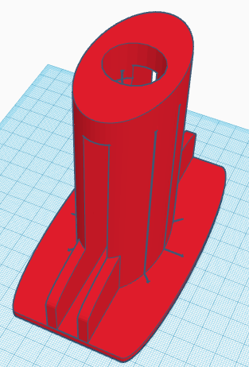

# Baseboard cutting guide (Guide coupe-plinthe)

This is a tool to help cut baseboard properly. It is suitable for PVC baseboard as it can be cut with a cutter.

- Baseboard used here was 11mm wide and 60mm height ;
- Cutter guides are 1mm wide ;

This guide was tested on [Goodhome baseboard](https://www.bricodepot.fr/catalogue/plinthe-pvc-imitation-ardoise-l-220-x-h-6-cm-x-ep-11-mm/prod60560/) 